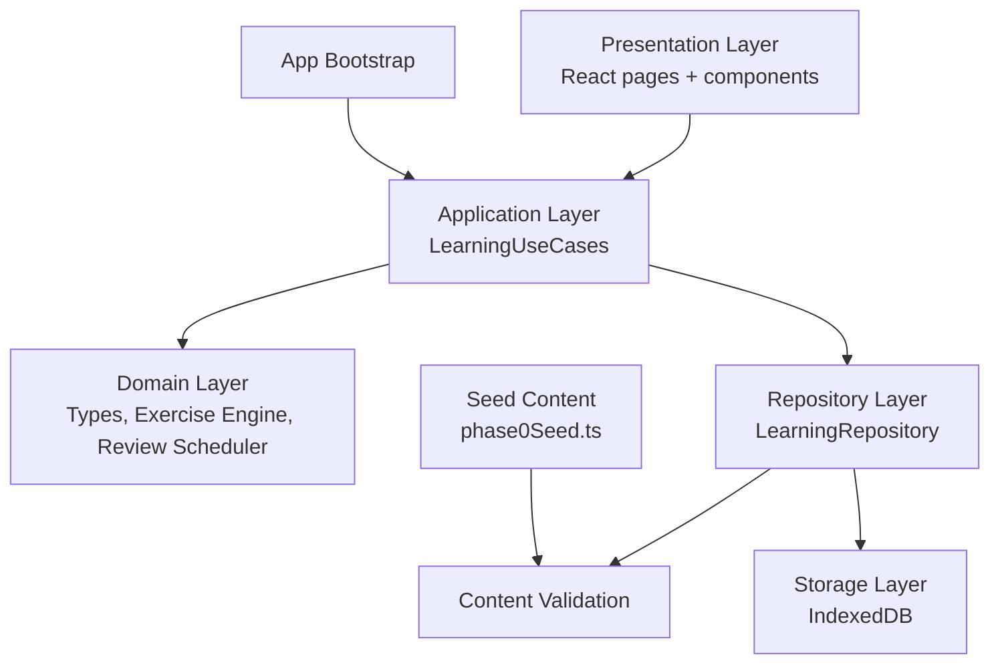
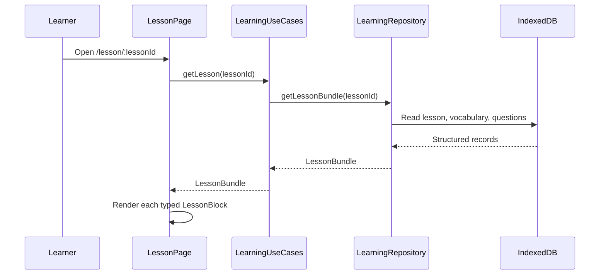
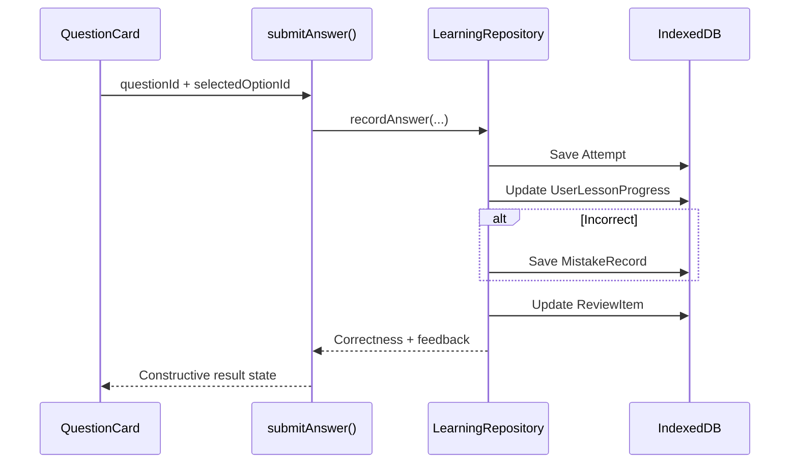

# English Academy — Phase 0 Architecture

**Status:** Working prototype foundation.  
**Scope boundary:** This version proves the content-driven, offline-first learning loop. It intentionally does not ship a full curriculum, cloud sync, authentication, media playback, AI tutor, advanced SRS, gamification, or payment features.

> **Architectural rule:** Presentation code calls application use cases; application use cases call repositories; repositories alone communicate with browser storage.

## 1. Runtime layers



| Layer | Primary responsibility | May depend on |
|---|---|---|
| Presentation | Routes, layout, accessible interactions, rendering lesson blocks | Application contracts and domain types |
| Application | Learner-facing use cases such as `getLesson()` and `submitAnswer()` | Repository interfaces |
| Domain | Stable entities, answer validation, scheduling contract | No UI or storage implementation |
| Repository | Seed orchestration, loading bundles, persistence orchestration | Storage adapter, content validator |
| Storage | IndexedDB transactions and versioned migrations | Browser IndexedDB API only |

The implementation prohibits direct IndexedDB calls from React pages and components. This keeps future server or cloud-sync replacements confined to the repository layer.

## 2. Folder structure

```text
client/src/
├── ai/                         # Provider-independent AI contract; no provider enabled
├── app/bootstrap/              # Versioned startup initialization
├── application/usecases/       # Presentation-safe actions
├── components/app/             # Shell and learning trail
├── components/learning/        # Block renderer and question interaction
├── core/errors/                # Typed application errors
├── core/services/              # Safe development logging
├── data/content/               # Seed content and validation
├── data/indexeddb/             # Storage adapter and migrations
├── data/repositories/          # Repository implementation
├── domain/learning/            # Stable entity contracts
├── domain/practice/            # Answer validation and scoring
├── domain/review/              # Replaceable review scheduler
└── pages/                      # Route-level presentation components
```

## 3. Content and learner data boundary

Content and learner data are intentionally distinct. Seeded course content can be upgraded without treating a learner’s attempt history as content. User-specific changes never modify global vocabulary or lesson records.

| Content entity | Learner-specific entity | Reason for separation |
|---|---|---|
| `Course`, `Level`, `Unit`, `Lesson` | `UserLessonProgress` | Curriculum can evolve while completion remains personal |
| `Question` | `Attempt`, `MistakeRecord`, question `ReviewItem` | A reusable question can appear in lesson, practice, test, or review |
| `VocabularyItem` | vocabulary `ReviewItem` | Definitions remain global; recall and scheduling remain personal |
| `MediaAsset` future contract | media-cache metadata future contract | Asset replacement does not corrupt learner history |

Every entity carries a stable `id`, `schemaVersion`, and `updatedAt` field. **IDs are never derived from visual order**, so content can be reordered safely.

## 4. Lesson rendering flow



The `LessonBlockRenderer` dispatches only supported block types. The Phase 0 schema currently demonstrates `heading`, `explanation`, `example`, `vocabulary`, `question`, and `review`; the domain contract leaves room for listening, speaking, writing, matching, sentence building, media, and test blocks in later phases.

## 5. Exercise and progress flow



The current `IntervalReviewScheduler` is a deliberately small, replaceable reference implementation. Future SM-2, FSRS, or recommendation logic should implement the `ReviewScheduler` interface rather than rewrite presentation code.

## 6. IndexedDB schema and migration policy

| Store | Primary key | Important index | Phase 0 use |
|---|---|---|---|
| `courses`, `levels`, `units`, `lessons` | `id` | `lessons.unitId` | Structured curriculum |
| `vocabulary` | `id` | — | Global vocabulary content |
| `questions` | `id` | `lessonId` | Reusable structured questions |
| `progress` | `id` | `userLesson: [userId, lessonId]` | Completion, answer counts, last position |
| `attempts` | `id` | — | Answer history |
| `mistakes` | `id` | `userQuestion: [userId, questionId]` | Mistake Bank foundation |
| `reviewItems` | `id` | `due: nextReviewAt` | Review scheduling foundation |
| `settings` | `id` | — | Seed and local preference metadata |

Migration operations live in `data/indexeddb/EnglishAcademyDb.ts`. New storage versions must be additive where possible: add new stores or indexes, preserve stable keys, and write an explicit migration branch. The app must not silently erase learner records as part of a content update.

## 7. Validation and failure behaviour

The `ContentValidator` rejects duplicate global IDs, unknown lesson/question/vocabulary references, and question records whose correct option does not exist. Presentation code receives learner-readable messages through the typed `AppError` boundary. Development logging avoids answer text and personally identifying data.

| Error kind | Learner-facing behaviour |
|---|---|
| `ValidationError` | Reject malformed learner input or imported content before persistence |
| `StorageError` | Preserve the view and ask the learner to retry saving |
| `ContentError` | Explain that a lesson or question cannot currently be opened |
| `NetworkError` | Reserved for later online features; core Phase 0 learning remains available offline |
| `AIError` | Reserved for optional provider-based features with non-AI fallback |

## 8. AI and media extension points

`ai/AIProvider.ts` provides an adapter contract for explanation and writing feedback. There is no vendor SDK, model key, or live AI request in this Phase 0 build. Failure to access AI cannot block lesson, question, vocabulary, practice, or progress functionality.

The domain permits `audioAssetId` and `imageAssetId` references on vocabulary items. Future lesson media should be defined through a `MediaAsset` entity and referenced by ID rather than embedded as arbitrary URLs inside content blocks.

## 9. Import/export boundary

Phase 0 does not expose a user import/export button. When implemented, it must use a versioned envelope and the existing validation boundary:

```json
{
  "format": "english-academy-content",
  "formatVersion": 1,
  "exportedAt": "2026-08-19T00:00:00.000Z",
  "content": { "courses": [], "levels": [], "units": [], "lessons": [], "vocabulary": [], "questions": [] }
}
```

An import flow must validate the envelope, validate all entity references, show a conflict summary, and avoid overwriting user attempt/progress data without explicit confirmation.

## 10. Verification checklist

| Capability | Verification path |
|---|---|
| Structured content bootstraps | Open dashboard or any learning route |
| Lesson is content-driven | Open `/lesson/lesson-a1-greetings` |
| Question answer is persisted | Submit an answer, refresh, then open Progress/Practice |
| Wrong answers create a review candidate | Select an incorrect answer in Practice |
| Navigation is accessible | Use the persistent sidebar or mobile menu |
| Theme state is functional | Open Settings and choose Light, Dark, or Focus |
| Storage is decoupled from UI | Inspect page imports: pages use `LearningUseCases`, not IndexedDB |

## 11. Deliberate Phase 0 stop line

The prototype stops after validating the foundation. The next phase should review the module graph, content authoring workflow, schema evolution strategy, first production-level course scope, privacy requirements, and the preferred sync/authentication path before implementation begins.
